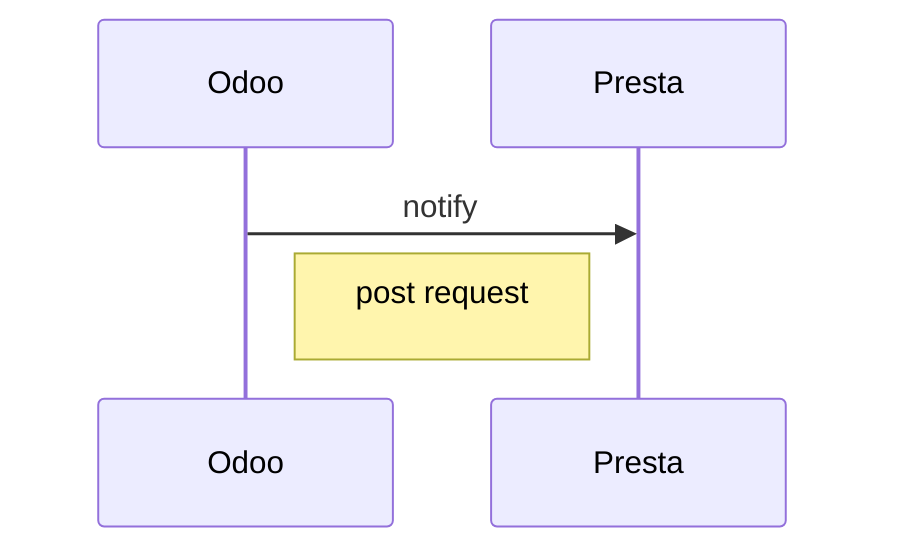

# Odoo Presta Connector

# Modèles
Équivalence des champs
> Note: les champs Odoo portant le suffixe **_id** ou **_ids** sont des champs
> relationnels: many2one, one2many ou many2many
> https://www.odoo.com/documentation/13.0/reference/orm.html#create-update

## Partner / contact
| Desc | Odoo | Prestashop | Note
|--|--|--|--|
| nom | **name** | name | *
| nom complet | display_name | name | champ calculé (ro)
| genre du client | **title** | id_gender | champ relationnel, cf. res.partner.title
| parent | parent_id | Partner |
| groupe du client | partner_group_id | |
| langue du client| lang | |
| nom de la societe du client / adresse | commercial_company_name | company |
| numéro de siret | siret | siret |
| libelle du client / adresse | name | firstname / lastname |
| adresse email | **email** | email |
| site web | website | website |
| actif / visible | active | active |
| position fiscale du client | property_account_position_id | id_position_fiscale_odoo |
| groupe | **partner_group_id** | | groupe |
| adresse: pays | **country_id** | pays | champ relationnel, cf. res.country
| adresse: état / province | state_id | | champ relationnel, cf. res.country.state |
| adresse: rue | street | address1 |
| adresse: rue 2 | street2 | address1 |
| adresse: code postal | zip | postcode |
| adresse: ville | city | city |
| commentaire | comment | other |
| numéro de téléphone | phone | phone |
| numéro de téléphone | mobile | phone_mobile |

* *champs **nom** requis à la création* 

## Flux

